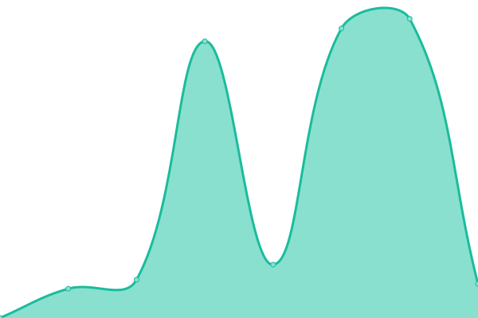

# [📈 Live Status](https://softsub.github.io/uptime): <!--live status--> **🟧 Partial outage**

This repository contains the open-source uptime monitor and status page for [softsub](https://softsub.github.io/uptime), powered by [Upptime](https://github.com/upptime/upptime).

With [Upptime](https://upptime.js.org), you can get your own unlimited and free uptime monitor and status page, powered entirely by a GitHub repository. We use [Issues](https://github.com/softsub/uptime/issues) as incident reports, [Actions](https://github.com/softsub/uptime/actions) as uptime monitors, and [Pages](https://softsub.github.io/uptime) for the status page.

<!--start: status pages-->
<!-- This summary is generated by Upptime (https://github.com/upptime/upptime) -->
<!-- Do not edit this manually, your changes will be overwritten -->
<!-- prettier-ignore -->
| URL | Status | History | Response Time | Uptime |
| --- | ------ | ------- | ------------- | ------ |
|  [Subscene Official](https://subscene.com) | 🟥 Down | [subscene-official.yml](https://github.com/softsub/uptime/commits/HEAD/history/subscene-official.yml) | 

 98ms
     
 | 

<a href="https://softsub.github.io/uptime/history/subscene-official">100.00%</a>
    

|  [Sub Berkas](https://sub.berkas.eu.org) | 🟥 Down | [sub-berkas.yml](https://github.com/softsub/uptime/commits/HEAD/history/sub-berkas.yml) | 

 218ms
     
 | 

<a href="https://softsub.github.io/uptime/history/sub-berkas">100.00%</a>
    

|  [Subs EU](https://subscene.eu.org) | 🟩 Up | [subs-eu.yml](https://github.com/softsub/uptime/commits/HEAD/history/subs-eu.yml) | 

 5030ms
     
 | 

<a href="https://softsub.github.io/uptime/history/subs-eu">100.00%</a>
    

|  [softsub cf](https://softsub.cf) | 🟩 Up | [softsub-cf.yml](https://github.com/softsub/uptime/commits/HEAD/history/softsub-cf.yml) | 

 4770ms
     
 | 

<a href="https://softsub.github.io/uptime/history/softsub-cf">100.00%</a>
    

|  [softsub tk](https://softsub.tk) | 🟩 Up | [softsub-tk.yml](https://github.com/softsub/uptime/commits/HEAD/history/softsub-tk.yml) | 

 3366ms
     
 | 

<a href="https://softsub.github.io/uptime/history/softsub-tk">100.00%</a>
    

|  [softsub ga](https://softsub.ga) | 🟥 Down | [softsub-ga.yml](https://github.com/softsub/uptime/commits/HEAD/history/softsub-ga.yml) | 

 0ms
     
 | 

<a href="https://softsub.github.io/uptime/history/softsub-ga">0.00%</a>
    

<!--end: status pages-->

[**Visit our status website →**](https://softsub.github.io/uptime)

## 📄 License

- Powered by: [Upptime](https://github.com/upptime/upptime)
- Code: [MIT](./LICENSE) © [softsub](https://softsub.github.io/uptime)
- Data in the `./history` directory: [Open Database License](https://opendatacommons.org/licenses/odbl/1-0/)
